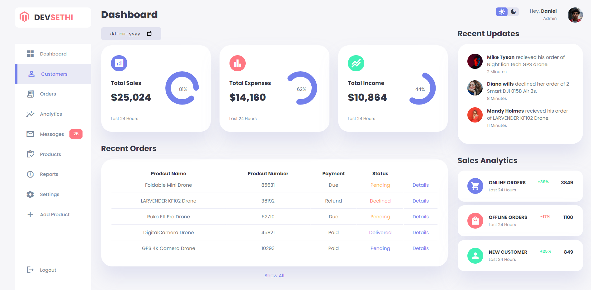
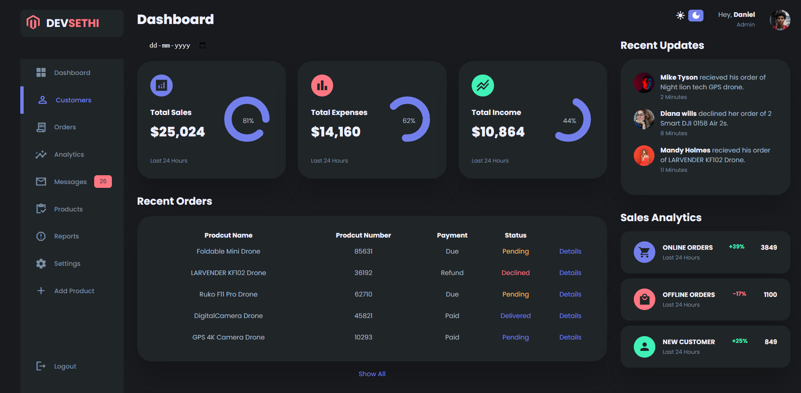

# Modern Admin Dashboard

Welcome to the Modern Admin Dashboard repository! This project is a responsive and feature-rich admin dashboard built with HTML, CSS, and JavaScript. It boasts a modern UI design with both light and dark themes to cater to different user preferences.

## Preview

### Light Theme


### Dark Theme


## Features

- **Responsive Design:** Ensures optimal viewing on various devices for administrators on the go.
- **Light and Dark Themes:** Toggle between light and dark themes for a personalized dashboard experience.
- **Interactive Charts and Graphs:** Visualize key metrics and data with modern charting libraries.
- **User Management:** Easily manage users, roles, and permissions within the dashboard.
- **Notifications:** Stay informed with real-time notifications and alerts.

## Getting Started

To explore this Admin Dashboard locally, follow these steps:

1. Clone the repository to your local machine:

   ```bash
   git clone https://github.com/Devsethi3/Admin-Dashboard.git
   ```

2. Open the `index.html` file in your preferred web browser.

## Themes

Toggle between light and dark themes using the theme switcher provided in the dashboard.

## Customization

Feel free to customize this dashboard to fit your specific needs. Update content, add new features, or modify the styles in the HTML, CSS, and JavaScript files.

## Contributing

If you'd like to contribute to this project, please follow these steps:

1. Fork the repository.
2. Create a new branch for your feature or improvement.
3. Make your changes and commit them with descriptive messages.
4. Push your changes to your forked repository.
5. Open a pull request to merge your changes into the main branch.

Explore the Modern Admin Dashboard, provide feedback, and consider contributing to its development. Thank you for checking out the repository!
